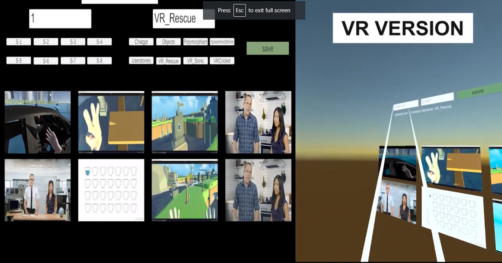
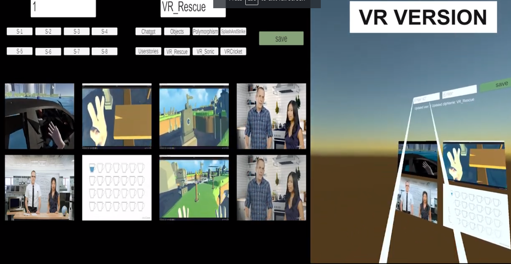

# Bloomingdale Window Portfolio

**Explore the creative world of Bloomingdale Window Portfolio, where art meets technology. Dive into our virtual reality (VR) and PC versions to discover a captivating showcase of our artistic endeavors and creative projects, brought to you by Bloomingdale Studio.**

## 📌 Table of Contents

1. [About the Project](#about-the-project)
2. [VR Version](#vr-version)
3. [PC Version](#pc-version)
4. [Installation](#installation)
5. [Usage](#usage)
6. [Contribution](#contribution)
7. [License](#license)
8. [Contact](#contact)
9. [Acknowledgements](#acknowledgements)

## 🎨 About the Project

Bloomingdale Window Portfolio is more than just a portfolio; it's an immersive journey into the realm of art and creativity. Our portfolio showcases a range of artistic projects and creative works, inviting you to explore and appreciate the beauty of our creations.

## 🕶️ VR Version

### Art in Virtual Reality

- **Immersive Art Showcase**: Step into the world of our artistic creations through VR technology.
- **Virtual Galleries**: Explore immersive virtual galleries that transport you to unique artistic landscapes.
- **Interact and Appreciate**: Engage with art in a whole new way, with interactive elements and dynamic visuals.

### Gallery

## 💻 PC Version

### Art on Your Screen

- **Stunning Art Collection**: View our diverse portfolio on your PC screen with high-resolution images.
- **Easy Navigation**: Browse through our projects with user-friendly navigation and categorization.
- **Artistic Experience**: Enjoy the artistic journey from the comfort of your PC.

### Gallery

## 💻 Installation

**Follow these instructions to explore Bloomingdale Window Portfolio:**

1. **VR Version**
   - Requirements: VR headset (e.g., Oculus Rift, HTC Vive)
   - Setup: Download the VR portfolio app from the app store or platform. Install and launch it on your VR headset.

2. **PC Version**
   - Requirements: A PC or laptop with a web browser
   - Setup: Visit our portfolio website at [www.bloomingdaleportfolio.com](https://www.bloomingdaleportfolio.com) and start exploring our projects.

## 🖱️ Usage

**Here's how to get started with Bloomingdale Window Portfolio:**

1. **VR Version**
   - Put on your VR headset and ensure it's properly calibrated.
   - Launch the VR portfolio app and navigate the virtual galleries to explore our artistic projects.

2. **PC Version**
   - Visit [www.bloomingdaleportfolio.com](https://www.bloomingdaleportfolio.com) using your web browser.
   - Browse through our portfolio categories and click on projects to view detailed information and high-quality images.

## 🤝 Contribution

We welcome contributions from the art and technology communities. If you'd like to contribute or showcase your work in our portfolio, please contact us through the provided contact information.

## 📄 License

Distributed under the XYZ License. See `LICENSE` for more information.

## 📞 Contact

Xrev Studio
- Email: contact@xrevstudio.com
- Website: [www.XREVstudio.com](https://www.bloomingdalestudio.com)

## 👏 Acknowledgements

- [Unity Engine](https://unity.com/)
- [Oculus SDK](https://developer.oculus.com/)
